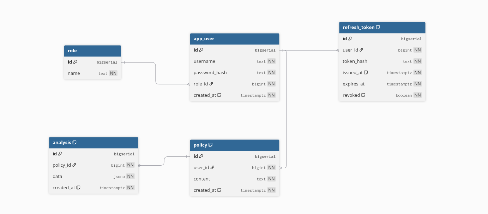

Policy Analyzer – Backend (Spring Boot + PostgreSQL)

Backend REST per Policy Analyzer, pensato per:
ingestire i JSON prodotti dallo script Python (“mini-project” con 4o-mini + regex-hints),
normalizzare & archiviare i risultati su PostgreSQL,
esporre API per la futura UI JavaFX e/o altre integrazioni.

Architettura

Spring Boot 3 (Web, Validation, Data JPA, Security)

PostgreSQL 15+

Flyway per versionare lo schema

Docker è stato usato come container per PostgreSql

The following image is the ER : 

